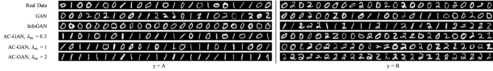
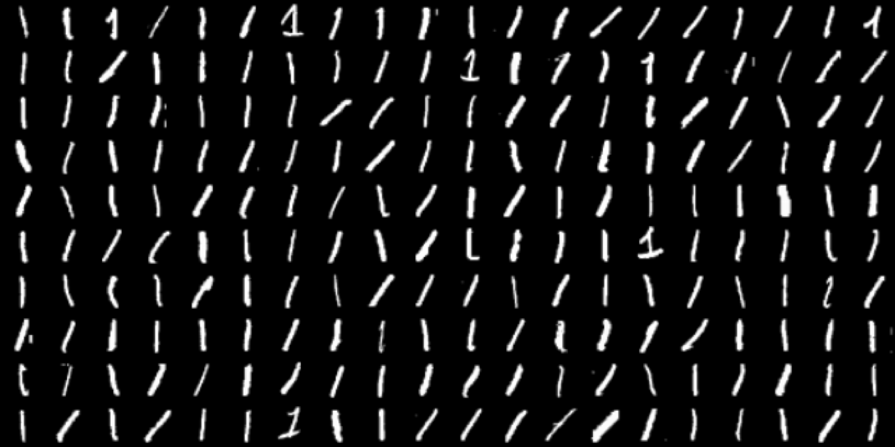
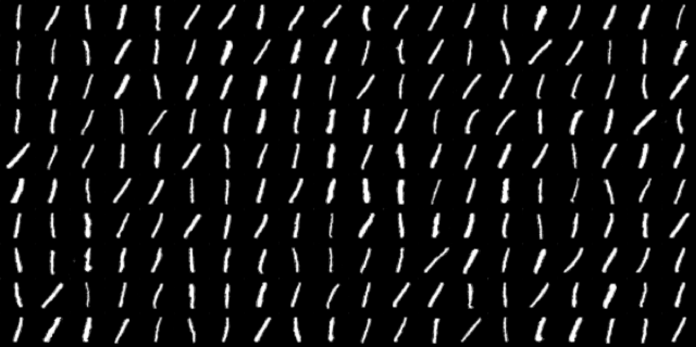

# acgan-biased

Code to reproduce the experiments in my [AC-GAN Learns a Biased Distribution](http://ruishu.io/docs/ac-gan-learns.pdf) write-up. The following experiments demonstrate that AC-GAN down-samples points near the decision boundary of the auxiliary classifier. 

### Dependencies

You'll need

```
tensorflow==1.2.1
scipy==0.17.1
numpy==1.13.1
tensorbayes==0.3.0
```

### Run AC-GAN

To run the MNIST example with classes A = {0, 1}, B = {0, 2}, 

```
python run_acgan.py --trg mnistbias --info INFO --cw CW
```
where `INFO` and `CW` are values for the mutual information weight and the classification weight. 


To run with the real MNIST data set,
```
python run_acgan.py --trg mnist32 --info INFO --cw CW
```

The defaults are `INFO = 1` and `CW = 1`. Note the following correspondences:
```
GAN: INFO = 0, CW = 0
InfoGAN: INFO > 0, CW = 0
AC-GAN: INFO > 0, CW > 0
```

### Results

By increasing `INFO` (denote as `lambda_m` in the following picture), we can visually observe that 0's get down-sampled.



When we run AC-GAN (with `lambda_m = 2`) on the real MNIST data, we also get to see something interesting. In the real dataset, 1's sometimes have serifs:

<p align = 'center'>

</p>

But when we run AC-GAN, it down-samples serifs:

<p align = 'center'>

</p>

1's with serifs are likely closer to the auxiliary classifier's decision boundary (for the digit classification problem) since serifs make the 1 look closer to a 2. Funnily enough, because AC-GAN down-samples class-ambiguous samples, it actually achieves a better Inception Score than the real MNIST digits. 
